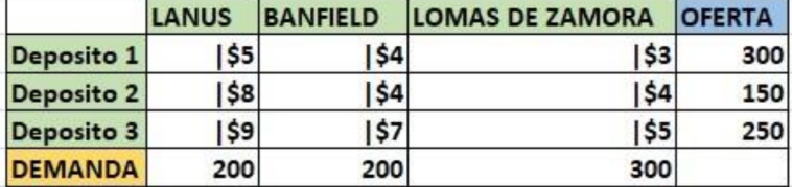
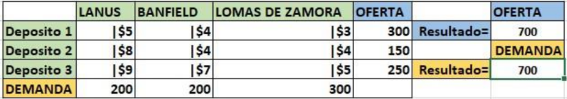
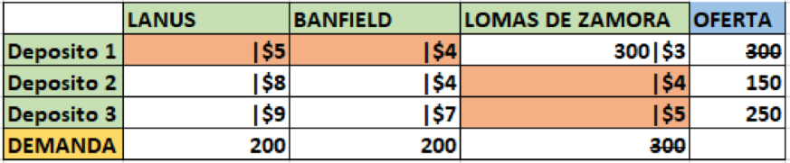
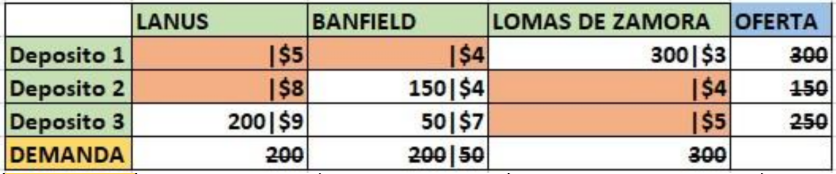
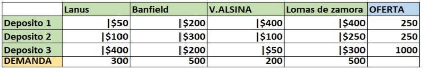
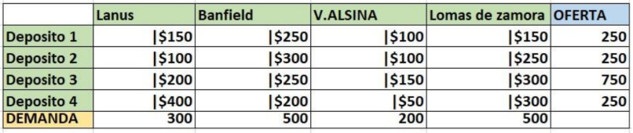

# Aproximación Costos Mínimos.

- Introducción:

El método de costos mínimo busca encontrar una solución inicial óptima para el modelo de transporte, priorizando las rutas de menor costo. El procedimiento consiste en asignar la mayor cantidad posible de unidades a la variable con el costo unitario más bajo dentro de la tabla.

- Inicio del método:

Para aplicar este método, primero se analizará una tabla de tareas de ejemplo. En esta tabla, el problema de transporte involucra tres depósitos que deben abastecer a tres locales ubicados en distintas zonas.

El primer paso consiste en sumar la demanda de cada local (<i>Lanús, Banfield y Lomas de Zomora</i>) y compararla con la oferta total de los tres depósitos. A continuación, se muestra una imagen de ejemplo.

Como se puede apreciar, la oferta y la demanda son equivalentes, lo que permite continuar con el método de aproximación de Costo mínimo.

> Más adelante explicará qué hacer en caso de que la oferta y la demanda no sean iguales.

El siguiente paso es comenzar con las asignaciones. En el método de costos mínimo, se prioriza la ruta con el costo de envío más bajo, asignando la mayor cantidad posible de unidades.

En este ejemplo, la primera asignación se realiza desde el depósito 1 hacia el local de Lomas de Zamora, asignando el máximo posible, que es `300 unidades`. Una vez hecha la signación, se eliminan estos `300` de la oferta del depósito 1 y de la demanda de Lomas de Zamora.

A continuación, se muestra una imagen de ejemplo:

En la imagen, las celdads correspondientes al depósito 1 y al local de Lomas de Zamora están marcadas en rojo. Esto inidica que tanto la demanda del local como la oferta del depósito han sido completamente abastecidas.

El siguiente paso en continuar con las asignaciones. El próximo local a abastecer es Banfield , al que se enviarán `150 unidades` desde el depósito 2. Sin embargo, esta cantidad no cubre por completo la demanda del local.

Como se observa, se ha enviado la totalidad de la oferta del depósito 2, pero aún queda `50 unidades` por abastecer en el local de banfield. Estas unidades serán enviadas desde el depósito 3, que también suministrará las `200 unidades` necesarias para cubrir la demanda del local de Lanús.

Ya hemos finalizado la asignación de unidades, y solo resta calcular el resultado de la solución inicial.

Para obtenerlo, es necesario multiplicar las unidades asignadas en cada celda por su correspondiente costo de envío.

Por ejemplo, en Lomas de Zamora, se multiplica 300 x 3. Una vez realizadas todas las multiplicaciones, se suman los valores obtenidos para determinar el costo total de la solución inicial.

El cálculo es el siguiente:

> (300 x 3) + (150 x 4) + (50 x 7) + (200 x 9) = 3.650

El resultado de nuestra solución inicial es 3.650, Esto significa que, el organizar el reparto utilizando el método de costo mínimo. Se obtiene un costo total de $3.650 es importante destacar que este resultado solo es la solución inicial y no es el resultado más optimo.

- Ejercicios:

    Resuelva las siguientes tablas con el método de transporte costo mínimo.
1. 

2. 

En la siguiente  tabla, el costo se expresa en unidades de tiempo, donde los segundos se representan con ('') y los minutos con ('). A continuación, se presenta la tabla de tareas:

3. 

4. Enunciado:

**Datos iniciales**

La casa central de la empresa `OCASA` está ubicada en Avenida Gral. Tomás de Iriarte 3070, CABA. Se dispone de los siguientes cuatro vehiculos para la distribución:

- Fiat Fiorino: Costo de $50 por kilómetro y capacidad de 60 bultos.
- Renault Kangoo: Costo de $55 por kilómetro y capacidad de 65 bultos.
- Peugeot Partner: Costo de $65 por kilómetro y capacidad de 65 bultos.
- Fiat Ducato: Costo de $95 por kilómetro y capacidad de 90 bultos.

Estos vehículos serán utilizados para abastecer la demanda en cuatro puntos de entrega de `OCASA`, con las siguientes direcciones y requerimientos:

1. Avenida Rivadavia 5338, CABA - Demanda: 70 bultos.
2. Avenida Directorio 2717, CABA - Demanda: 70 bultos.
3. Avenida Héctor José Cámpora 4130, CABA - Demanda: 70 bultos.
4. Moreno 1127, CABA - Demanda: 70 bultos.

Utilizando estos datos, se debe construir la tabla de tareas y luego calcular la solución inicial aplicando el método de Costo Mínimo.

5. Enunciado:

La central operativa de la empresa `Andreani` se encuentra en la calle Zapiola 4567, CABA. Para realizar la distribución diaria, la empresa cuenta con los siguientes cuatro vehículos:

- Citroën Berlingo: Costo de $48 por kilómetro y capacidad de 60 bultos.
- Chevrolet Spin Cargo: Costo de $52 por kilómetro y capacidad de 65 bultos.
- Volkswagen Caddy: Costo de $60 por kilómetro y capacidad de 70 bultos.
- Mercedes-Benz Sprinter: Costo de $90 por kilómetro y capacidad de 100 bultos.

Estos vehículos deben ser utilizados para cubrir la demanda en cuatro puntos de entrega de Andreani, con las siguientes direcciones y cantidades requeridas:

1. Avenida Corrientes 6200, CABA – Demanda: 80 bultos.
2. Avenida San Juan 3540, CABA – Demanda: 70 bultos.
3. Calle Emilio Mitre 2145, CABA – Demanda: 60 bultos.
4. Avenida Francisco Beiró 1456, CABA – Demanda: 85 bultos.

Utilizando estos datos, se debe construir la tabla de tareas y luego calcular la solución inicial aplicando el método de Costo Mínimo.